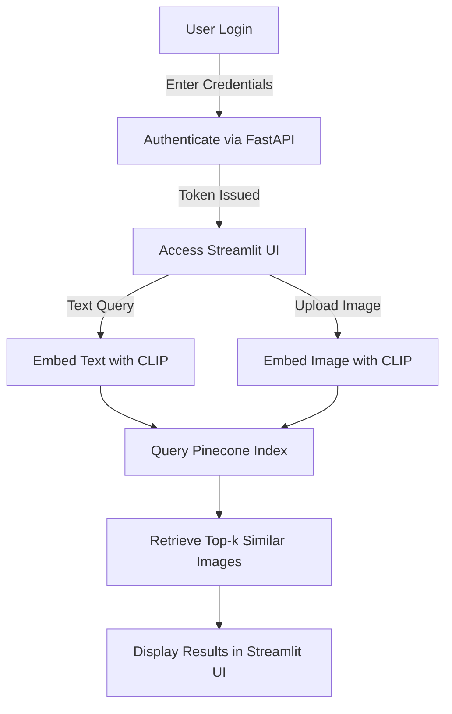

# 🔍 Image Search System

This project is an **AI-powered image search system** using **Streamlit (frontend)** and **FastAPI (backend)**. It allows users to search for images based on text queries or uploaded images, leveraging **CLIP embeddings** stored in **Pinecone**.

---
## 📌 Features
- 🔐 **User Authentication** (JWT-based login/logout)
- 🔠 **Text-based Image Search** using CLIP
- 🖼️ **Image-based Search** to find similar images
- 🚀 **FastAPI Backend** with secure endpoints
- 🎨 **Streamlit UI** for interactive searching

---
## 🛠 Technologies Used
- **Python** (FastAPI & Streamlit)
- **CLIP Model** (OpenAI’s Vision-Language Model)
- **Pinecone** (Vector Database)
- **JWT Authentication**

---
## 📥 Installation

### **1️⃣ Clone the Repository**
```sh
git clone https://github.com/logi-22/text-image1.git
cd text-image1.git
```

### **2️⃣ Install Dependencies**
```sh
pip install -r requirements.txt
```

### **3️⃣ Run the FastAPI Backend**
```sh
uvicorn main:app --host 0.0.0.0 --port 7860
```

### **4️⃣ Run the Streamlit Frontend**
```sh
streamlit run app.py
```

---
## 📊 Workflow Diagram


---
## 📂 API Endpoints

### **1️⃣ User Authentication**
- `POST /token` → Authenticate user & get JWT token

### **2️⃣ Image Search Endpoints**
- `GET /search/text/` → Search for images using text query
- `POST /search/image/` → Search for similar images by uploading an image

---
## 📌 Usage
### **1️⃣ Login with Username & Password**
- Default user: `admin` | Password: `password123` (Modify in `main.py` for security)

### **2️⃣ Search for Images**
- Enter a **text query** or **upload an image**.
- Results are retrieved based on **CLIP embeddings stored in Pinecone**.

### **3️⃣ Logout Anytime**
- Click the **Logout** button in the sidebar to clear authentication.


